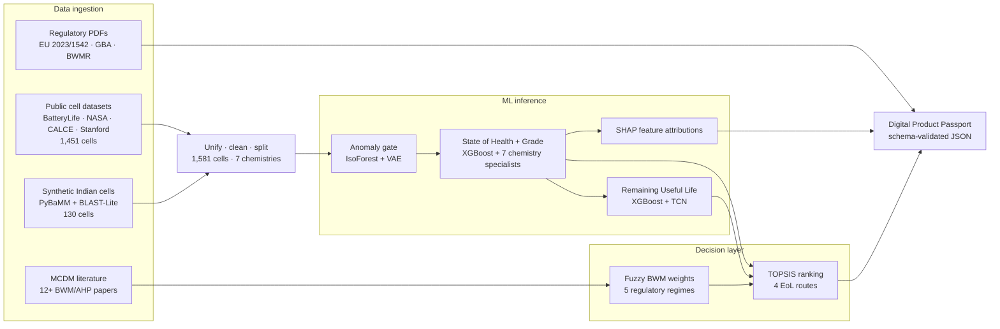

# Hybrid ML-MCDM Framework for EV Battery End-of-Life Routing

[](#)
[](https://huggingface.co/cmpunkmannu/hybrid-ml-mcdm-battery-eol)
[](https://www.python.org)
[](LICENSE)

A research-grade pipeline that predicts an electric-vehicle battery's State of Health and Remaining Useful Life from cycle data, then recommends an end-of-life route — grid-scale energy storage, home battery, component reuse, or direct recycling — under five regulatory weight regimes. Outputs a Digital Product Passport reconciled across EU Regulation 2023/1542 Annex XIII, the Global Battery Alliance Battery Pass v1.2, and India BWMR 2022 (with 2024 and 2025 amendments).

> **Manuscript** — in preparation.

## Pipeline



## Key results

- State of Health predicted to within **2.43 pp RMSE** on held-out test cells (R² 0.996); chemistry-specialist routing lifts under-represented-chemistry grade-accuracy by up to **+5 pp** vs a single global model.
- Remaining Useful Life predicted to within **1.92 %** of the prediction range (classical) and **2.23 %** (deep learning).
- Routing recommendation flips under different regulatory regimes — the framework's headline regulatory-sensitivity finding.
- Training corpus: **1,581 cells across 7 chemistries** (NMC, LFP, NCA, LCO, Zn-ion, Na-ion, other) — public lab datasets (BatteryLife, NASA-PCOE, CALCE, Stanford) plus 130 synthetic Indian-context cells generated via PyBaMM and BLAST-Lite.

## Quick start

```bash
git clone https://github.com/Rishabhmannu/hybrid-ml-mcdm-battery-eol.git
cd hybrid-ml-mcdm-battery-eol
pip install -r frontend/requirements.txt
streamlit run frontend/app.py
```

First launch downloads ~90 MB of model weights from the Hugging Face Hub and caches them locally — subsequent runs are instant.

## Tech stack

- **ML + decision theory** — XGBoost · PyTorch · scikit-learn · SHAP · Optuna · Fuzzy BWM · TOPSIS
- **Data + simulation** — pandas · NumPy · PyArrow · PyBaMM · BLAST-Lite
- **Frontend + reporting** — Streamlit · Plotly · ReportLab · Kaleido · jsonschema
- **Hosting** — Hugging Face Hub (weights) · Streamlit Community Cloud (demo)

## Project structure

```
src/             Library code (loaders, MCDM, DPP, model wrappers)
scripts/         Training, evaluation, ablation, export scripts
frontend/        Streamlit demo + PDF cell-report export
results/tables/  Small reproducibility artefacts (metrics / logs)
data/            Runtime artefacts (full corpus stays local)
```

## Known limitations

- The training corpus is curated lab data plus 130 synthetic Indian-context cells; generalisation to real fleet data remains future work.
- Carbon-footprint values in the Digital Product Passport are chemistry-keyed literature defaults, not measured lifecycle assessments.
- The framework has not been deployed in a live battery management system, fleet management platform, or regulator submission pipeline.

## Citation

```bibtex
@misc{kumar2026hybrid,
  author = {Kumar, Rishabh},
  title  = {Hybrid ML-MCDM Framework for EV Battery End-of-Life Routing in India},
  year   = {2026},
  url    = {https://github.com/Rishabhmannu/hybrid-ml-mcdm-battery-eol}
}
```

## License

Released under the [MIT License](LICENSE). Training-corpus datasets retain their original permissive licences; synthetic Indian-context cells generated for this work are released under MIT.

## Contact

Rishabh Kumar — IIIT Allahabad — rishabhkumards07@gmail.com · [LinkedIn](https://www.linkedin.com/in/rishabh-kumar-815601230) · [github.com/Rishabhmannu](https://github.com/Rishabhmannu)
